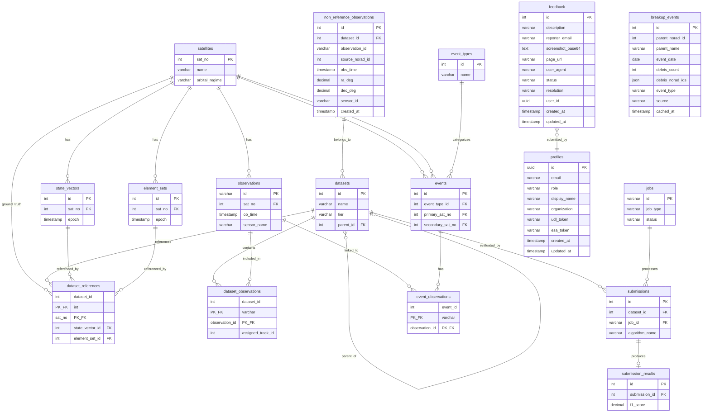

# UCT Benchmark Database - Entity Relationship Diagram

## Overview ERD

This diagram shows the main entities and their relationships:

---

## Detailed Table Schemas

### Core Entities

#### satellites
Primary key: `sat_no`

| Column | Type | Key | Description |
|--------|------|-----|-------------|
| sat_no | INTEGER | PK | NORAD catalog number |
| name | VARCHAR | | Satellite name |
| cospar_id | VARCHAR | | International designator |
| object_type | VARCHAR | | PAYLOAD, DEBRIS, ROCKET BODY, etc. |
| launch_date | DATE | | |
| decay_date | DATE | | |
| mass_kg | DECIMAL(10,2) | | |
| cross_section_m2 | DECIMAL(10,4) | | |
| drag_coeff | DECIMAL(6,4) | | |
| srp_coeff | DECIMAL(6,4) | | Solar radiation pressure coefficient |
| orbital_regime | VARCHAR | | LEO, MEO, GEO, HEO |
| created_at | TIMESTAMP | | |
| updated_at | TIMESTAMP | | |

#### observations
Primary key: `id`

| Column | Type | Key | Description |
|--------|------|-----|-------------|
| id | VARCHAR | PK | Unique observation identifier |
| sat_no | INTEGER | FK → satellites | Satellite this observation belongs to |
| ob_time | TIMESTAMP | | Observation timestamp |
| ra | DECIMAL(12,8) | | Right ascension (degrees) |
| declination | DECIMAL(12,8) | | Declination (degrees) |
| range_km | DECIMAL(12,4) | | Range (km), nullable for angles-only |
| range_rate_km_s | DECIMAL(10,6) | | Range rate (km/s) |
| azimuth | DECIMAL(12,8) | | Azimuth (degrees) |
| elevation | DECIMAL(12,8) | | Elevation (degrees) |
| sensor_name | VARCHAR | | Sensor identifier |
| data_mode | VARCHAR | | SIMULATED, REAL |
| track_id | VARCHAR | | Track grouping identifier |
| is_uct | BOOLEAN | | True if uncorrelated track |
| is_simulated | BOOLEAN | | True if simulated data |
| created_at | TIMESTAMP | | |

#### state_vectors
Primary key: `id`

| Column | Type | Key | Description |
|--------|------|-----|-------------|
| id | INTEGER | PK | |
| sat_no | INTEGER | FK → satellites | |
| epoch | TIMESTAMP | | State epoch |
| x_pos | DECIMAL(16,6) | | X position (km) |
| y_pos | DECIMAL(16,6) | | Y position (km) |
| z_pos | DECIMAL(16,6) | | Z position (km) |
| x_vel | DECIMAL(16,9) | | X velocity (km/s) |
| y_vel | DECIMAL(16,9) | | Y velocity (km/s) |
| z_vel | DECIMAL(16,9) | | Z velocity (km/s) |
| covariance | JSON | | 6x6 covariance matrix |
| source | VARCHAR | | Origin of state vector |
| data_mode | VARCHAR | | SIMULATED, REAL |
| created_at | TIMESTAMP | | |

#### element_sets
Primary key: `id`

| Column | Type | Key | Description |
|--------|------|-----|-------------|
| id | INTEGER | PK | |
| sat_no | INTEGER | FK → satellites | |
| line1 | VARCHAR | | TLE line 1 |
| line2 | VARCHAR | | TLE line 2 |
| epoch | TIMESTAMP | | TLE epoch |
| inclination | DECIMAL(10,6) | | Inclination (degrees) |
| raan | DECIMAL(10,6) | | Right ascension of ascending node |
| eccentricity | DECIMAL(12,10) | | Eccentricity |
| arg_perigee | DECIMAL(10,6) | | Argument of perigee (degrees) |
| mean_anomaly | DECIMAL(10,6) | | Mean anomaly (degrees) |
| mean_motion | DECIMAL(14,10) | | Mean motion (rev/day) |
| b_star | DECIMAL(16,12) | | B* drag term |
| semi_major_axis_km | DECIMAL(12,4) | | Semi-major axis (km) |
| period_minutes | DECIMAL(10,4) | | Orbital period (minutes) |
| source | VARCHAR | | Origin of TLE |
| created_at | TIMESTAMP | | |

---

### Dataset Management

#### datasets
Primary key: `id`

| Column | Type | Key | Description |
|--------|------|-----|-------------|
| id | INTEGER | PK | |
| name | VARCHAR | | Dataset name |
| code | VARCHAR | | Short code identifier |
| version | INTEGER | | Version number |
| parent_id | INTEGER | FK → datasets | Parent dataset (for derived datasets) |
| tier | VARCHAR | | Difficulty tier (EASY, MEDIUM, HARD) |
| orbital_regime | VARCHAR | | LEO, MEO, GEO, MIXED |
| time_window_start | TIMESTAMP | | Start of observation window |
| time_window_end | TIMESTAMP | | End of observation window |
| observation_count | INTEGER | | Total observations in dataset |
| satellite_count | INTEGER | | Number of satellites |
| avg_coverage | DECIMAL(8,4) | | Average observation coverage |
| avg_obs_count | DECIMAL(8,2) | | Average observations per satellite |
| max_track_gap | DECIMAL(8,4) | | Maximum gap between tracks (hours) |
| generation_params | JSON | | Parameters used to generate dataset |
| status | VARCHAR | | DRAFT, ACTIVE, ARCHIVED |
| created_at | TIMESTAMP | | |
| updated_at | TIMESTAMP | | |
| json_path | VARCHAR | | Path to JSON export |
| parquet_path | VARCHAR | | Path to Parquet export |

#### dataset_observations
**Composite primary key: (`dataset_id`, `observation_id`)**

Junction table linking datasets to observations.

| Column | Type | Key | Description |
|--------|------|-----|-------------|
| dataset_id | INTEGER | PK, FK → datasets | |
| observation_id | VARCHAR | PK, FK → observations | |
| assigned_track_id | INTEGER | | Algorithm-assigned track ID |
| assigned_object_id | INTEGER | | Algorithm-assigned object ID |

#### dataset_references
**Composite primary key: (`dataset_id`, `sat_no`)**

Ground truth references for each satellite in a dataset.

| Column | Type | Key | Description |
|--------|------|-----|-------------|
| dataset_id | INTEGER | PK, FK → datasets | |
| sat_no | INTEGER | PK, FK → satellites | |
| state_vector_id | INTEGER | FK → state_vectors | Reference state vector |
| element_set_id | INTEGER | FK → element_sets | Reference TLE |
| grouped_obs_ids | JSON | | List of observation IDs for this satellite |

---

### Event Tracking

#### event_types
Primary key: `id`

| Column | Type | Key | Description |
|--------|------|-----|-------------|
| id | INTEGER | PK | |
| name | VARCHAR | | MANEUVER, CONJUNCTION, FRAGMENTATION, etc. |
| description | VARCHAR | | |

#### events
Primary key: `id`

| Column | Type | Key | Description |
|--------|------|-----|-------------|
| id | INTEGER | PK | |
| event_type_id | INTEGER | FK → event_types | |
| event_time_start | TIMESTAMP | | Event start time |
| event_time_end | TIMESTAMP | | Event end time |
| primary_sat_no | INTEGER | FK → satellites | Primary satellite involved |
| secondary_sat_no | INTEGER | FK → satellites | Secondary satellite (for conjunctions) |
| confidence | DECIMAL(5,4) | | Confidence score (0-1) |
| detection_method | VARCHAR | | How event was detected |
| source | VARCHAR | | Source of event data |
| external_id | VARCHAR | | External reference ID |
| labelled_by | VARCHAR | | Who labeled this event |
| labelled_at | TIMESTAMP | | When event was labeled |
| notes | VARCHAR | | Additional notes |

#### event_observations
**Composite primary key: (`event_id`, `observation_id`)**

Junction table linking events to observations.

| Column | Type | Key | Description |
|--------|------|-----|-------------|
| event_id | INTEGER | PK, FK → events | |
| observation_id | VARCHAR | PK, FK → observations | |

---

### Evaluation & Jobs

#### submissions
Primary key: `id`

| Column | Type | Key | Description |
|--------|------|-----|-------------|
| id | INTEGER | PK | |
| dataset_id | INTEGER | FK → datasets | Dataset being evaluated |
| algorithm_name | VARCHAR | | Name of the algorithm |
| version | VARCHAR | | Algorithm version |
| description | VARCHAR | | Description of submission |
| file_path | VARCHAR | | Path to submission file |
| status | VARCHAR | | PENDING, PROCESSING, COMPLETED, FAILED |
| job_id | VARCHAR | FK → jobs | Processing job |
| error_message | VARCHAR | | Error message if failed |
| created_at | TIMESTAMP | | |
| completed_at | TIMESTAMP | | |

#### submission_results
Primary key: `id`

| Column | Type | Key | Description |
|--------|------|-----|-------------|
| id | INTEGER | PK | |
| submission_id | INTEGER | FK → submissions | |
| true_positives | INTEGER | | Correct associations |
| false_positives | INTEGER | | Incorrect associations |
| false_negatives | INTEGER | | Missed associations |
| precision | DECIMAL(10,6) | | TP / (TP + FP) |
| recall | DECIMAL(10,6) | | TP / (TP + FN) |
| f1_score | DECIMAL(10,6) | | Harmonic mean of precision/recall |
| position_rms_km | DECIMAL(12,6) | | Position RMS error (km) |
| velocity_rms_km_s | DECIMAL(12,9) | | Velocity RMS error (km/s) |
| mahalanobis_distance | DECIMAL(12,6) | | Statistical distance metric |
| ra_residual_rms_arcsec | DECIMAL(12,6) | | RA residual RMS (arcsec) |
| dec_residual_rms_arcsec | DECIMAL(12,6) | | Dec residual RMS (arcsec) |
| raw_results | JSON | | Detailed results data |
| processing_time_seconds | DECIMAL(12,3) | | Time to process |
| created_at | TIMESTAMP | | |

#### jobs
Primary key: `id`

| Column | Type | Key | Description |
|--------|------|-----|-------------|
| id | VARCHAR | PK | UUID |
| job_type | VARCHAR | | Type of job |
| status | VARCHAR | | PENDING, RUNNING, COMPLETED, FAILED |
| progress | INTEGER | | Progress percentage (0-100) |
| result | JSON | | Job result data |
| error | VARCHAR | | Error message if failed |
| metadata | JSON | | Additional job metadata |
| created_at | TIMESTAMP | | |
| started_at | TIMESTAMP | | |
| completed_at | TIMESTAMP | | |

---

### System

#### _schema_metadata
Primary key: `key`

| Column | Type | Key | Description |
|--------|------|-----|-------------|
| key | VARCHAR | PK | Metadata key |
| value | VARCHAR | | Metadata value |
| updated_at | TIMESTAMP | | |

---

## Key Relationships Summary

| From | To | Type | FK Column | Description |
|------|-----|------|-----------|-------------|
| observations | satellites | N:1 | sat_no | Each observation belongs to one satellite |
| state_vectors | satellites | N:1 | sat_no | Each state vector belongs to one satellite |
| element_sets | satellites | N:1 | sat_no | Each TLE belongs to one satellite |
| events | satellites | N:1 | primary_sat_no | Primary satellite in event |
| events | satellites | N:1 | secondary_sat_no | Secondary satellite in event |
| events | event_types | N:1 | event_type_id | Event categorization |
| datasets | datasets | N:1 | parent_id | Self-referential parent-child |
| dataset_observations | datasets | N:1 | dataset_id | Junction: dataset side |
| dataset_observations | observations | N:1 | observation_id | Junction: observation side |
| dataset_references | datasets | N:1 | dataset_id | Junction: dataset side |
| dataset_references | satellites | N:1 | sat_no | Junction: satellite side |
| dataset_references | state_vectors | N:1 | state_vector_id | Reference state |
| dataset_references | element_sets | N:1 | element_set_id | Reference TLE |
| event_observations | events | N:1 | event_id | Junction: event side |
| event_observations | observations | N:1 | observation_id | Junction: observation side |
| submissions | datasets | N:1 | dataset_id | Submission targets a dataset |
| submissions | jobs | N:1 | job_id | Submission processed by job |
| submission_results | submissions | 1:1 | submission_id | One result per submission |

---

## Notes

1. **Junction Tables**: `dataset_observations`, `dataset_references`, and `event_observations` use composite primary keys combining their foreign key columns.

2. **Satellite Identifier**: `sat_no` (NORAD catalog number) is used consistently as the satellite identifier across all tables.

3. **Observation Identifier**: `observations.id` is VARCHAR to support various ID formats from different data sources.

4. **Jobs Identifier**: `jobs.id` is VARCHAR to support UUID format.
