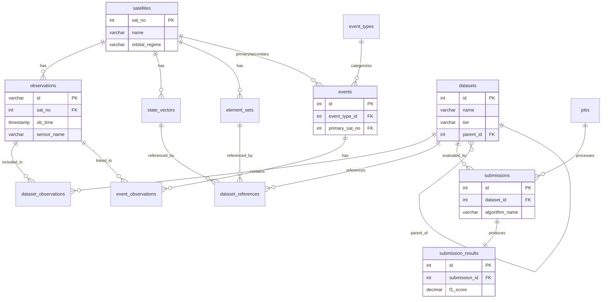

# UCT Benchmark Database - Entity Relationship Diagram

## Overview ERD

This simplified diagram shows the main entities and their relationships:

---

## Detailed Table Schemas

### Core Entities

#### satellites
| Column | Type | Key |
|--------|------|-----|
| sat_no | INTEGER | PK |
| name | VARCHAR | |
| cospar_id | VARCHAR | |
| object_type | VARCHAR | |
| launch_date | DATE | |
| decay_date | DATE | |
| mass_kg | DECIMAL | |
| cross_section_m2 | DECIMAL | |
| drag_coeff | DECIMAL | |
| srp_coeff | DECIMAL | |
| orbital_regime | VARCHAR | |
| created_at | TIMESTAMP | |
| updated_at | TIMESTAMP | |

#### observations
| Column | Type | Key |
|--------|------|-----|
| id | VARCHAR | PK |
| sat_no | INTEGER | FK |
| ob_time | TIMESTAMP | |
| ra | DECIMAL | |
| declination | DECIMAL | |
| range_km | DECIMAL | |
| range_rate_km_s | DECIMAL | |
| azimuth | DECIMAL | |
| elevation | DECIMAL | |
| sensor_name | VARCHAR | |
| data_mode | VARCHAR | |
| track_id | VARCHAR | |
| is_uct | BOOLEAN | |
| is_simulated | BOOLEAN | |
| created_at | TIMESTAMP | |

#### state_vectors
| Column | Type | Key |
|--------|------|-----|
| id | INTEGER | PK |
| sat_no | INTEGER | FK |
| epoch | TIMESTAMP | |
| x_pos | DECIMAL | |
| y_pos | DECIMAL | |
| z_pos | DECIMAL | |
| x_vel | DECIMAL | |
| y_vel | DECIMAL | |
| z_vel | DECIMAL | |
| covariance | JSON | |
| source | VARCHAR | |
| data_mode | VARCHAR | |
| created_at | TIMESTAMP | |

#### element_sets
| Column | Type | Key |
|--------|------|-----|
| id | INTEGER | PK |
| sat_no | INTEGER | FK |
| line1 | VARCHAR | |
| line2 | VARCHAR | |
| epoch | TIMESTAMP | |
| inclination | DECIMAL | |
| raan | DECIMAL | |
| eccentricity | DECIMAL | |
| arg_perigee | DECIMAL | |
| mean_anomaly | DECIMAL | |
| mean_motion | DECIMAL | |
| b_star | DECIMAL | |
| semi_major_axis_km | DECIMAL | |
| period_minutes | DECIMAL | |
| source | VARCHAR | |
| created_at | TIMESTAMP | |

---

### Dataset Management

#### datasets
| Column | Type | Key |
|--------|------|-----|
| id | INTEGER | PK |
| name | VARCHAR | |
| code | VARCHAR | |
| version | INTEGER | |
| parent_id | INTEGER | FK |
| tier | VARCHAR | |
| orbital_regime | VARCHAR | |
| time_window_start | TIMESTAMP | |
| time_window_end | TIMESTAMP | |
| observation_count | INTEGER | |
| satellite_count | INTEGER | |
| avg_coverage | DECIMAL | |
| avg_obs_count | DECIMAL | |
| max_track_gap | DECIMAL | |
| generation_params | JSON | |
| status | VARCHAR | |
| created_at | TIMESTAMP | |
| updated_at | TIMESTAMP | |
| json_path | VARCHAR | |
| parquet_path | VARCHAR | |

#### dataset_observations
| Column | Type | Key |
|--------|------|-----|
| dataset_id | INTEGER | FK |
| observation_id | VARCHAR | FK |
| assigned_track_id | INTEGER | |
| assigned_object_id | INTEGER | |

#### dataset_references
| Column | Type | Key |
|--------|------|-----|
| dataset_id | INTEGER | FK |
| sat_no | INTEGER | FK |
| state_vector_id | INTEGER | FK |
| element_set_id | INTEGER | FK |
| grouped_obs_ids | JSON | |

---

### Event Tracking

#### event_types
| Column | Type | Key |
|--------|------|-----|
| id | INTEGER | PK |
| name | VARCHAR | |
| description | VARCHAR | |

#### events
| Column | Type | Key |
|--------|------|-----|
| id | INTEGER | PK |
| event_type_id | INTEGER | FK |
| event_time_start | TIMESTAMP | |
| event_time_end | TIMESTAMP | |
| primary_sat_no | INTEGER | FK |
| secondary_sat_no | INTEGER | FK |
| confidence | DECIMAL | |
| detection_method | VARCHAR | |
| source | VARCHAR | |
| external_id | VARCHAR | |
| labelled_by | VARCHAR | |
| labelled_at | TIMESTAMP | |
| notes | VARCHAR | |

#### event_observations
| Column | Type | Key |
|--------|------|-----|
| event_id | INTEGER | FK |
| observation_id | VARCHAR | FK |

---

### Evaluation & Jobs

#### submissions
| Column | Type | Key |
|--------|------|-----|
| id | INTEGER | PK |
| dataset_id | INTEGER | FK |
| algorithm_name | VARCHAR | |
| version | VARCHAR | |
| description | VARCHAR | |
| file_path | VARCHAR | |
| status | VARCHAR | |
| job_id | VARCHAR | FK |
| error_message | VARCHAR | |
| created_at | TIMESTAMP | |
| completed_at | TIMESTAMP | |

#### submission_results
| Column | Type | Key |
|--------|------|-----|
| id | INTEGER | PK |
| submission_id | INTEGER | FK |
| true_positives | INTEGER | |
| false_positives | INTEGER | |
| false_negatives | INTEGER | |
| precision | DECIMAL | |
| recall | DECIMAL | |
| f1_score | DECIMAL | |
| position_rms_km | DECIMAL | |
| velocity_rms_km_s | DECIMAL | |
| mahalanobis_distance | DECIMAL | |
| ra_residual_rms_arcsec | DECIMAL | |
| dec_residual_rms_arcsec | DECIMAL | |
| raw_results | JSON | |
| processing_time_seconds | DECIMAL | |
| created_at | TIMESTAMP | |

#### jobs
| Column | Type | Key |
|--------|------|-----|
| id | VARCHAR | PK |
| job_type | VARCHAR | |
| status | VARCHAR | |
| progress | INTEGER | |
| result | JSON | |
| error | VARCHAR | |
| metadata | JSON | |
| created_at | TIMESTAMP | |
| started_at | TIMESTAMP | |
| completed_at | TIMESTAMP | |

---

### System

#### _schema_metadata
| Column | Type | Key |
|--------|------|-----|
| key | VARCHAR | PK |
| value | VARCHAR | |
| updated_at | TIMESTAMP | |

---

## Key Relationships Summary

| From | To | Relationship | Description |
|------|-----|--------------|-------------|
| satellites | observations | 1:N | One satellite has many observations |
| satellites | state_vectors | 1:N | Multiple state solutions per satellite |
| satellites | element_sets | 1:N | Multiple TLEs per satellite |
| satellites | events | 1:N | Satellite can be primary or secondary in events |
| datasets | dataset_observations | 1:N | Dataset contains many observation links |
| datasets | dataset_references | 1:N | Dataset references ground truth states |
| datasets | datasets | 1:N | Parent-child hierarchy |
| datasets | submissions | 1:N | Dataset evaluated by many algorithms |
| observations | dataset_observations | 1:N | Observation in multiple datasets |
| observations | event_observations | 1:N | Observation linked to events |
| event_types | events | 1:N | Type categorizes many events |
| events | event_observations | 1:N | Event has many observations |
| submissions | submission_results | 1:1 | One result per submission |
| jobs | submissions | 1:N | Job processes submissions |
