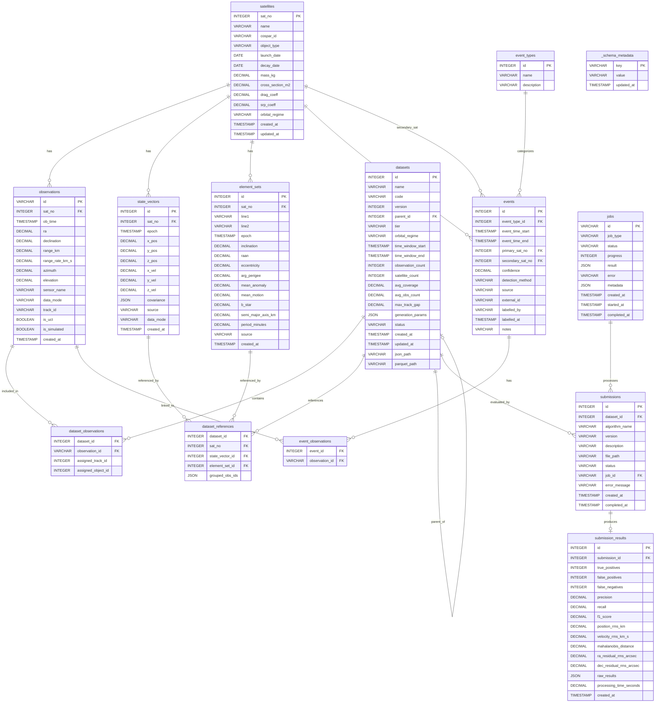

# UCT Benchmark Database - Entity Relationship Diagram

## ERD (Mermaid)

## Table Descriptions

### Core Entities

| Table | Description |
|-------|-------------|
| **satellites** | Catalog of space objects (satellites, debris) with physical and orbital properties |
| **observations** | Individual sensor measurements (angular, range, radar) of satellites |
| **state_vectors** | Position/velocity vectors in Cartesian coordinates at specific epochs |
| **element_sets** | Two-Line Element (TLE) sets with Keplerian orbital elements |

### Dataset Management

| Table | Description |
|-------|-------------|
| **datasets** | Benchmark datasets with configurable difficulty tiers and time windows |
| **dataset_observations** | Junction table linking observations to datasets with track assignments |
| **dataset_references** | Ground truth references linking datasets to satellites and their states |

### Event Tracking

| Table | Description |
|-------|-------------|
| **event_types** | Categorization of space events (maneuvers, conjunctions, fragmentations) |
| **events** | Detected or labeled space events with confidence scores |
| **event_observations** | Junction table linking observations to events |

### Evaluation & Jobs

| Table | Description |
|-------|-------------|
| **submissions** | Algorithm submissions for benchmark evaluation |
| **submission_results** | Evaluation metrics (precision, recall, F1, residuals) for submissions |
| **jobs** | Async job tracking for long-running operations |

### System

| Table | Description |
|-------|-------------|
| **_schema_metadata** | Database schema versioning and configuration |

## Key Relationships

1. **Satellites → Observations**: One satellite can have many observations over time
2. **Satellites → State Vectors**: Multiple state solutions per satellite at different epochs
3. **Satellites → Element Sets**: Multiple TLE sets per satellite (updated periodically)
4. **Datasets → Observations**: Many-to-many via `dataset_observations` junction table
5. **Datasets → Reference Data**: Links to ground truth states via `dataset_references`
6. **Events → Observations**: Many-to-many via `event_observations` junction table
7. **Submissions → Results**: One-to-one evaluation results per submission
8. **Jobs → Submissions**: Jobs process submission evaluations asynchronously
