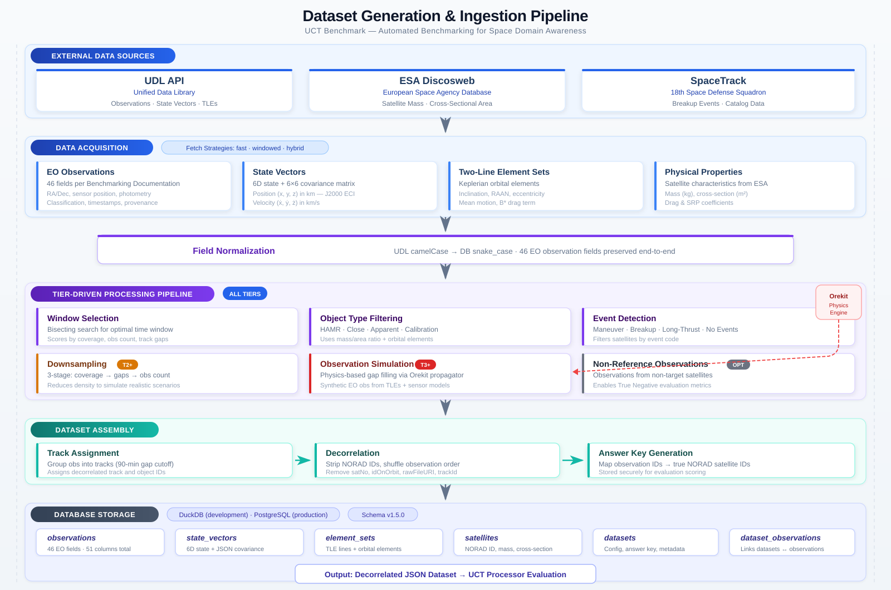

# Dataset Generation & Ingestion Pipeline

> UCT Benchmark — Automated Benchmarking for Space Domain Awareness

## Pipeline Overview

The ingestion pipeline transforms raw space surveillance data from three external sources into decorrelated benchmark datasets for evaluating UCT (Uncorrelated Track) Processors. The pipeline is organized into six stages, each executed in sequence during dataset generation.

---

## Stage 1: External Data Sources

| Source | Provider | Data |
|--------|----------|------|
| **UDL API** | Unified Data Library | EO Observations, State Vectors, TLEs |
| **ESA Discosweb** | European Space Agency | Satellite mass, cross-sectional area |
| **SpaceTrack** | 18th Space Defense Squadron | Breakup events, catalog data |

## Stage 2: Data Acquisition

Data is fetched using one of three **search strategies** (configurable per dataset):

- **fast** — Single bulk query, fastest but less precise window targeting
- **windowed** — Bisecting search to find optimal time windows matching quality criteria
- **hybrid** — Fast initial fetch with windowed refinement

Four categories of data are acquired:

| Category | Description |
|----------|-------------|
| **EO Observations** | 46 fields per the Benchmarking Documentation (RA/Dec, sensor position, photometry, classification, timestamps, provenance) |
| **State Vectors** | 6D state (position + velocity) with 6x6 covariance matrix in J2000 ECI frame |
| **Two-Line Element Sets** | Keplerian orbital elements (inclination, RAAN, eccentricity, mean motion, B* drag) |
| **Physical Properties** | Satellite mass (kg), cross-sectional area (m²), drag and SRP coefficients from ESA |

## Stage 3: Field Normalization

All data passes through the field normalization layer, which:

- Converts UDL API **camelCase** field names to database **snake_case** column names
- Preserves all **46 EO observation fields** end-to-end through the pipeline
- Handles aliases from multiple data sources (UDL, simulation, SpaceTrack)

## Stage 4: Tier-Driven Processing Pipeline

Processing steps are applied based on the dataset's **data tier** (T1–T5):

### All Tiers

| Step | Description |
|------|-------------|
| **Window Selection** | Bisecting search algorithm to find optimal observation time windows. Scores candidate windows by coverage, observation count, and track gap metrics. |
| **Object Type Filtering** | Filters satellites by type code: HAMR (high area-to-mass ratio), Close proximity, Apparent proximity, Calibration, or Unspecified. Uses mass/area ratio and orbital elements. |
| **Event Detection** | Filters by event type: Maneuver between observations, Breakup event, Long-duration/low-thrust, or No events. |

### Tier-Specific Steps

| Step | Tier | Description |
|------|------|-------------|
| **Downsampling** | T2+ | 3-stage reduction: coverage thinning, gap widening, observation count limiting. Reduces observation density to simulate realistic sparse scenarios. |
| **Observation Simulation** | T3+ | Physics-based gap filling using the **Orekit** propagation engine. Generates synthetic EO observations from TLEs and sensor models (GEODSS, SBSS, Commercial EO). |
| **Non-Reference Observations** | Optional | Injects observations from non-target satellites at a configurable ratio (1–50%). Enables True Negative evaluation metrics (accuracy, specificity). |

## Stage 5: Dataset Assembly

Three sequential steps prepare the final benchmark dataset:

1. **Track Assignment** — Groups observations into tracks using a 90-minute gap cutoff. Assigns decorrelated track and object IDs.
2. **Decorrelation** — Strips identifying information (NORAD satellite numbers, `idOnOrbit`, `rawFileURI`, `trackId`) and shuffles observation order.
3. **Answer Key Generation** — Creates a mapping from observation IDs to true NORAD satellite IDs. Stored securely for evaluation scoring.

## Stage 6: Database Storage

All data is persisted to the database (**DuckDB** in development, **PostgreSQL** in production), schema version 1.5.0:

| Table | Contents |
|-------|----------|
| `observations` | 46 EO fields, 51 columns total |
| `state_vectors` | 6D state + JSON-encoded covariance |
| `element_sets` | TLE lines + parsed orbital elements |
| `satellites` | NORAD ID, mass, cross-section |
| `datasets` | Configuration, answer key, metadata |
| `dataset_observations` | Junction table linking datasets to observations |

---

## Output

The pipeline produces a **decorrelated JSON dataset** ready for UCT Processor evaluation, containing blind observations with no satellite identity information. The answer key is held separately for automated scoring.
